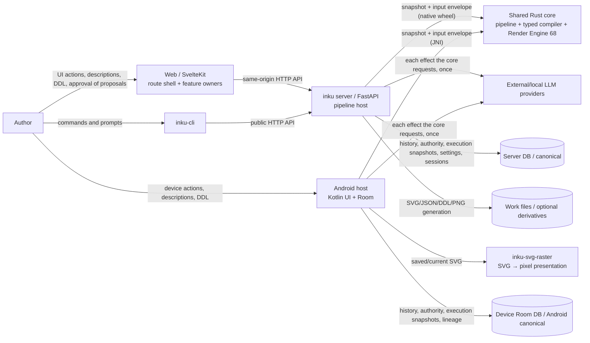

# System context

Web and the CLI use the Server HTTP API. Android does not go through the Server: its Kotlin host on the device calls the same shared Rust core through JNI and saves to its own Room DB. On both the Server and Android, the shared Rust core owns every decision about meaning from the description through visible DDL and Score to SVG. The Python and Kotlin hosts handle provider transport, atomic saves, UI, and host-specific settings. The Server DB is canonical for Server works; automatic work files are optional derivatives.

The shared Rust core consists of five host-neutral crates (`inku-score`, `inku-ddl`, `inku-pipeline`, `inku-render`, `inku-svg-raster`) and three binding crates. The authoring state machine (`inku-pipeline`) takes a snapshot and an input and returns the next snapshot, progress events, and at most one effect. The host performs that effect (an LLM call or a CAS save of visible DDL) exactly once and returns an identity-preserving result. The core decides retries, fallback, authority transitions, and when to compile. The typed compiler (`inku-ddl`) lowers visible DDL to a Score once, and the Render Engine (`inku-render`) performs the SVG. Android sends saved/current SVG through a separate raster crate and treats pixels as derived Bitmap/Compose presentation.

Within Web, `+page.svelte` retains route lifecycle, view composition, and owner wiring while route-instance owners hold Session, Work, Batch, Demo, Refinement, Settings, history/lineage, and viewport state. For shared-pipeline executions (DDL edits, approval of completion proposals, forks from a description), the controller in `features/pipeline/` reads the saved state, displays it, and forwards only the author's commands to the Server. The canonical owner diagram lives in `client-boundaries.md`; the Server internals and the Rust crate diagram live in `server-components.md`.

## External and trust boundaries

| Boundary | Contract | Evidence |
|---|---|---|
| Browser → Web | Route-instance feature owners hold UI state; localStorage, IndexedDB, and File System Access stay in the browser | `+page.svelte`; `features/session/state.svelte.ts`; `features/work/state.svelte.ts`; `features/canvas/refinement-coordinator.svelte.ts`; `features/export/save-target.ts` |
| Web → API | Vite proxy during development and SvelteKit hook proxy in distribution. A client cannot send snapshots, authority sidecars, effect results, or resource policies | `vite.config.ts`; `web/src/hooks.server.ts`; `pipeline_candidate.py` (module docstring) |
| CLI → API | HTTP through `urllib` only; no Server package imports | `cli/src/inku_cli/cli.py` |
| API → Rust core | Passes trusted configuration and the snapshot as owned byte buffers and receives the next snapshot and the performance. Requires matching binding and protocol versions at startup | `pipeline_candidate.py:PipelineBinding`; `inku-render-python`; `inku-pipeline-uniffi` |
| API → provider | After the model reference is resolved, performs each effect the core requests with one transport attempt and never retries on its own | `pipeline_provider.py:SingleAttemptProvider`; `model_settings.py` |
| Android → Rust core | Passes the same byte protocol through JNI. New performances use the core's render input; replay of a saved Score uses `renderSaved` under the restored resource policy (only the device-only legacy 9:5 format uses `AndroidRenderHost`) | `SharedPipelineHost.kt`; `NativePipelineBridge.kt`; `AndroidWorkPipeline.kt`; `inku-render-android` |
| Android SVG → raster | Sends canonical SVG and target geometry, then receives explicit premultiplied RGBA8/stride data | `RustArtworkRasterizer.kt`; `core/crates/inku-svg-raster` |
| API → DB | Saves the CAS of visible DDL and authority, action acknowledgments, execution snapshots, Server-generated history, lineage, settings, and authentication state | `persistence/variation_authority.py`; `db.py`; `pipeline_product.py:save_result` |
| API → files | A best-effort queue independent of DB save; when full, only the file job is skipped | `api_core/state.py`; `rendering.py:_submit_history_artifact_save` |
| Android | A separate trust and storage boundary. Meaning and rendering are shared Rust; Room, provider settings, and the `rh3` computation remain host-owned | `InkuRepository`; `InkuDatabase`; `RoomSharedPipelineStore`; `AndroidWorkPipeline` |

## Node and edge evidence

| Diagram element | Evidence ID | Main evidence |
|---|---|---|
| Author/Web/CLI/Android | `SYS-USER`, `SYS-WEB`, `SYS-CLI`, `SYS-ANDROID` | Entry points and UI/parser code |
| FastAPI/provider | `SYS-API`, `PIPE-HOST`, `SYS-LLM` | `api.py`, `pipeline_runtime.py`, `pipeline_provider.py` |
| Shared Rust core | `SYS-CORE`, `PIPE-MACHINE`, `PIPE-TYPED-DDL`, `PIPE-RENDER` | `core/Cargo.toml`, `inku-pipeline`, `inku-ddl`, `inku-render` |
| Raster | `PIPE-RASTER` | `inku-svg-raster`, `RustArtworkRasterizer.kt` |
| Server DB/files | `SYS-DB`, `DATA-AUTHORITY`, `SYS-FILES` | `db.py`, `variation_authority.py`, `rendering.py` |
| Android Room | `SYS-ANDROID` | `data/db/InkuDatabase.kt`, `RoomSharedPipelineStore.kt` |
