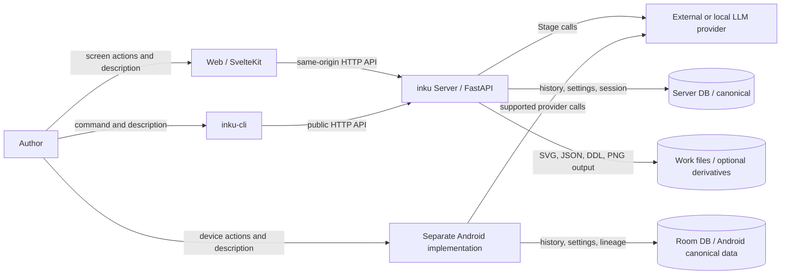

# System context

Web and the CLI use the Server HTTP API. Android is not a thin client over that same pipeline: it carries a separate DDL pipeline, renderer, and Room DB on the device. The Server DB is canonical for Server works; automatic work files are optional derivatives.

## External and trust boundaries

| Boundary | Contract | Evidence |
|---|---|---|
| Browser → Web | UI state, localStorage, IndexedDB, and File System Access stay in the browser | `+page.svelte`; `features/export/save-target.ts` |
| Web → API | Vite proxy in development; SvelteKit hook proxy in the packaged service | `vite.config.ts`; `web/src/hooks.server.ts` |
| CLI → API | HTTP through `urllib`; no Server package import | `cli/src/inku_cli/cli.py` |
| API → provider | Resolve provider/model, then use Anthropic, Gemini, or OpenAI-compatible connections | `model_settings.py`; `interpreter.py`; `composer.py` |
| API → DB | Persist Server history, lineage, settings, and authentication state | `db.py`; `rendering.py` |
| API → files | Best-effort queue independent of DB persistence; a full queue skips only the file job | `api_core/state.py`; `rendering.py:_submit_history_artifact_save` |
| Android | Separate trust, pipeline, and storage boundary | `InkuRepository`; `InkuDatabase`; `LocalFallbackPipeline` |

## Evidence map

| Diagram element | Evidence ID | Primary source |
|---|---|---|
| Author, Web, CLI, Android | `SYS-USER`, `SYS-WEB`, `SYS-CLI`, `SYS-ANDROID` | Entry points and client code |
| FastAPI and provider | `SYS-API`, `SYS-LLM` | `api.py`, `model_settings.py` |
| Server DB and files | `SYS-DB`, `SYS-FILES` | `db.py`, `rendering.py` |
| Android Room | `SYS-ANDROID` | `data/db/InkuDatabase.kt` |
