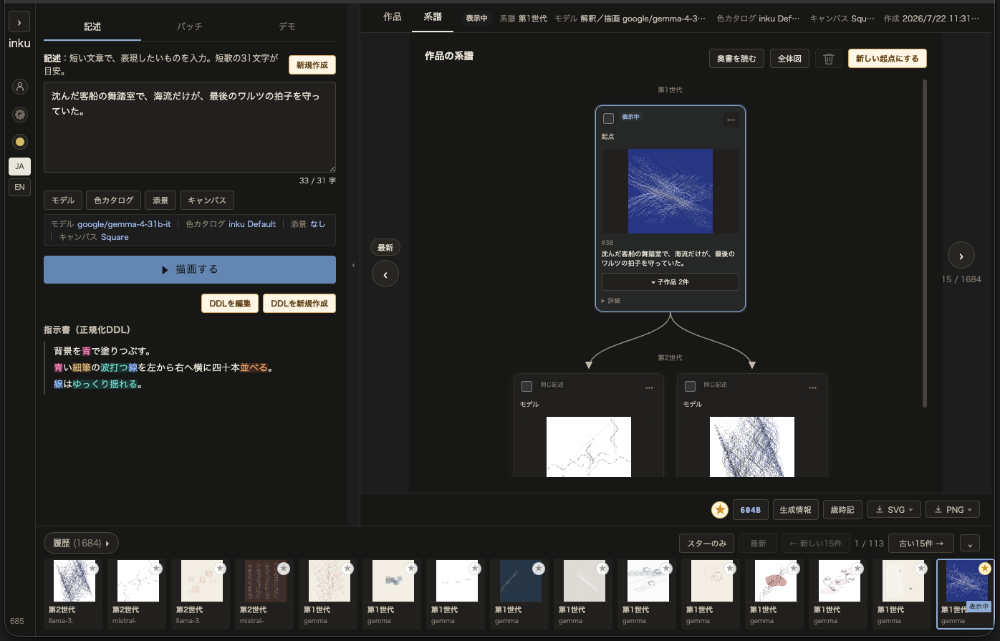

# 推敲の詳細

[README.ja.md](../../README.ja.md) の「推敲による作品の追求」の続きである。五つの引き直しのうち
**変奏**の強度、AI に任せる二つの方式、系譜とエディションの扱いをここに置く。

## 変奏の強度

**変奏**だけは、どこまで動かすかを三段階で指定する。生成後、実際に動いた軸が表示されるので、何が変わったのかを推測せずに済む。

| 強度 | 動く軸 | 動かない軸 |
|---|---|---|
| 小 | 型の差し替え・採用本数のうち一軸 | 焦点・色・構図 |
| 中 | 小の軸 + タッチ材質・焦点・主色/対比色（一〜二軸） | 構図族・型の系統 |
| 大 | 中の軸 + 構図族・型の系統（二〜四軸） | ——絵の骨格まで動きます |

## AI に委ねる

自分で軸を選ぶかわりに、世代を重ねること自体を AI に任せることもできる。二つの方式がある。

- **ランダムな自動推敲**——許可した要素の中から、世代ごとにランダムに軸を選んで重ねる
- **AI Vision による自動推敲**——各世代の画像を実際に観察し、次に試す方向を次の世代へ渡す

どちらにも方向性（「華やかで、かつ、涼しげに」のような一文）を与えられる。任せている間も、生まれた世代はすべて系譜に残るので、途中の一枚を選んでそこから手で引き直しに戻れる。

## 世代を重ねる

候補は一案ずつでも、グリッドに四案並べてでも作れる。気に入ったものを選んで残し（複数選択可）、**選んだ理由をひとこと添えられる**。**選ぶことは、書くことと並ぶ創作の一部である。**

<table><tr><td></td></tr></table>

残した一枚は次の親になる。そこからまた別の演奏を、別の色を、変奏を——という往復のすべてが**系譜**に記録され、どの世代から何を引き直して今の一枚に至ったかを後から辿れる。履歴には seed と作品エディション ID が保存されるので、途中のどの世代もいつでも同じ姿で再現できる。
