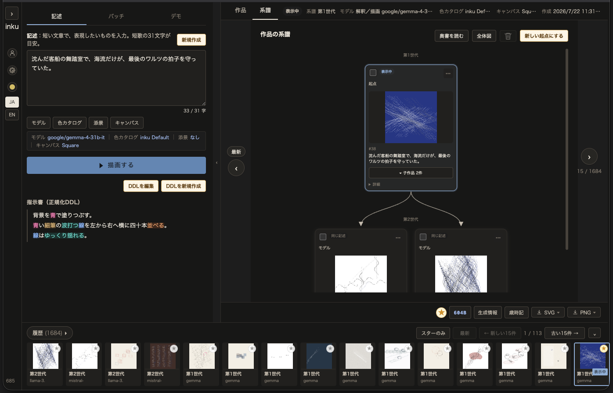

# 推敲の詳細

[README.ja.md](../../README.ja.md) の「推敲による作品の追求」の続きである。AI に任せる二つの方式、
系譜とエディションの扱いをここに置く。

## 変奏（廃止）

変奏は 2026-10-04 に廃止した。焦点の読み替えを 2026-09-27 に外してから動かすものが無く、推敲と紛らわしかったためである。前に変奏で作った作品の系譜には「変奏（旧）」の辺が残り、その作品の生成情報には当時の変奏 seed と強度が出る。

## AI に委ねる

自分で軸を選ぶかわりに、世代を重ねること自体を AI に任せることもできる。二つの方式がある。

- **ランダムな自動推敲**——許可した要素の中から、世代ごとにランダムに軸を選んで重ねる
- **AI Vision による自動推敲**——各世代の画像を実際に観察し、次に試す方向を次の世代へ渡す

どちらにも方向性（「華やかで、かつ、涼しげに」のような一文）を与えられる。任せている間も、生まれた世代はすべて系譜に残るので、途中の一枚を選んでそこから手で引き直しに戻れる。

## 世代を重ねる

候補は一案ずつでも、グリッドに四案並べてでも作れる。気に入ったものを選んで残し（複数選択可）、**選んだ理由をひとこと添えられる**。**選ぶことは、書くことと並ぶ創作の一部である。**

<table><tr><td></td></tr></table>

残した一枚は次の親になる。そこからまた別の演奏を、別の色を、別の構図を——という往復のすべてが**系譜**に記録され、どの世代から何を引き直して今の一枚に至ったかを後から辿れる。履歴には seed と作品エディション ID が保存されるので、途中のどの世代もいつでも同じ姿で再現できる。
