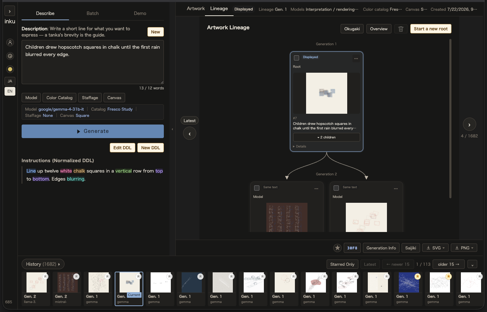

# Revision, in detail

This continues "Pursuing the work through revision" in [README.md](../../README.md). The two
ways of handing the work to the AI, and the handling of lineage and editions are collected here.

## Variation (retired)

Variation was retired on 2026-10-04. Once the focus reinterpretation was removed on 2026-09-27 it had nothing left to move, and the word was confusing next to refinement. Works made by an earlier variation keep a "Variation (retired)" edge in their lineage, and their provenance shows the variation seed and amplitude of that time.

## Letting the AI carry it

Instead of picking the axis yourself, you can hand the act of accumulating generations to the AI. There are two modes.

- **Random automatic refinement** — each generation picks an axis at random from the ones you allowed
- **AI Vision automatic refinement** — each image is actually observed, and one direction is passed to the next generation

Either mode accepts a direction of your own (a sentence such as "festive, and yet cool"). Everything born while the AI runs is still recorded in the lineage, so you can pick a drawing from the middle of the run and go back to redrawing it by hand.

## Accumulating generations

Candidates can be made one at a time or as a grid of four. Keep the ones you like (multiple selection is allowed) and **attach a short note about why you chose them**. **Choosing is part of the work, alongside writing.**

<table><tr><td></td></tr></table>

What you keep becomes the next parent. Another performance from there, another catalog, another composition — the whole back and forth is recorded in the **lineage**, so you can trace later which generation you redrew what from to arrive at the drawing in front of you. History stores seeds and an edition ID, so any generation along the way can be reproduced exactly as it was.
